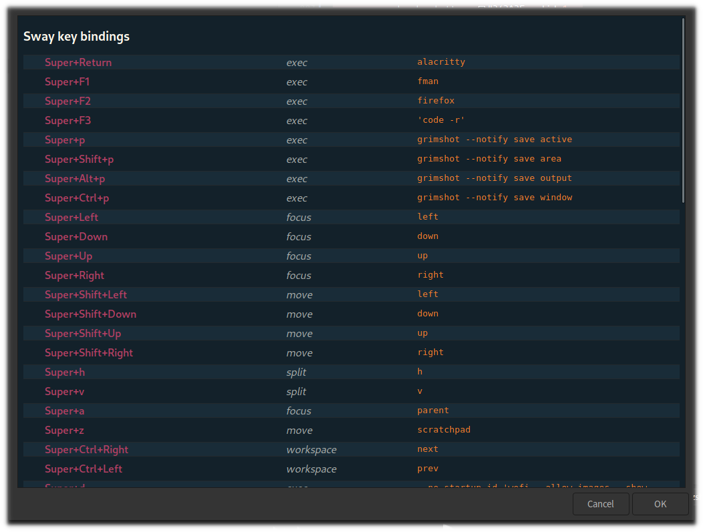

# swaykeys

Display helper and parser for sway key bindings. Written with [Deno](https://deno.land/) for creating a key binding cheat sheet with Zenity.



## Usage

At the moment the easiest way is

```sh
 deno run --allow-run --allow-write https://raw.githubusercontent.com/SirJson/swaykeys/trunk/main.ts
 ```

I will later upload a bundled script somewhere better fitted